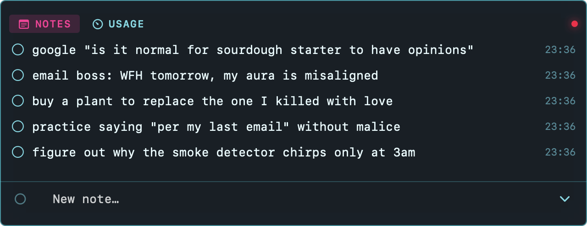
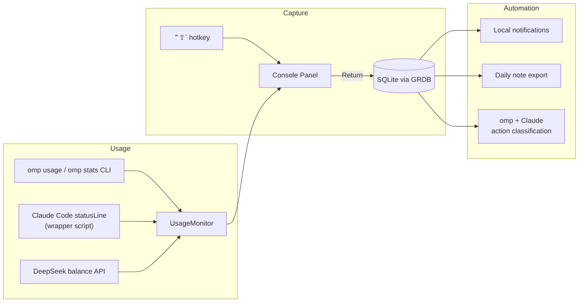
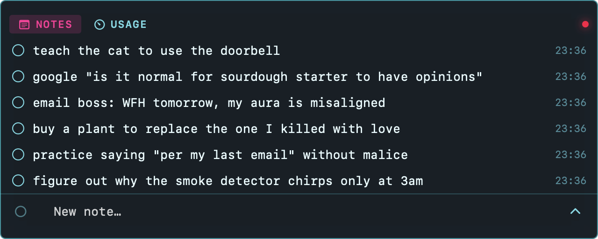
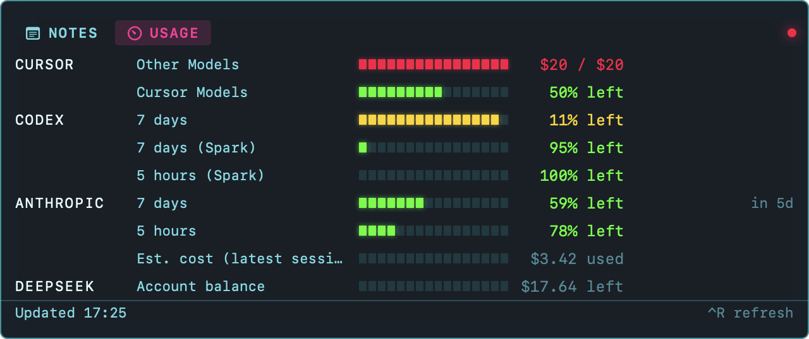

# Console Mode

A macOS 26 quick-capture note console that lives in the menu bar and pops up over
whatever you're doing. Summon it with **⌃⇧`** (Control–Shift–backtick), type a
line, press Return, keep working. No window to find, no app to switch to.



## Why

Most note-taking friction isn't "where do I write it down" — it's the four
seconds of context switch to get there: find the app, find the window, click
into it, click back out. That's enough friction that half the thoughts worth
capturing don't get captured.

Console Mode is built around a single idea: capture should cost one keystroke
and zero window management. It floats over your current app, takes a line,
and gets out of the way — Esc or a click outside dismisses it, no app-switch
required to get back to what you were doing. Everything else (search, review,
tags, reminders) is one `/` command away.

It also happens to be the same panel for watching your LLM usage burn down
across every provider you pay for, because if you're already glancing at a
menu-bar overlay a dozen times a day, that's a good place to put "you're at
5% of your Anthropic 5-hour window" too.

## How it works



- **Capture** — `AppDelegate` installs a global hotkey (`KeyboardShortcuts`)
  that toggles a borderless `NSPanel`. Notes save to a local SQLite database
  (`GRDB`) at `~/Library/Application Support/ConsoleMode/notes.sqlite`. Note
  content stays local unless you turn on Obsidian export or action review;
  the Usage tab's `omp`/Claude Code/DeepSeek sources each do their own
  network I/O to fetch quota and balance figures, independent of your notes.
- **Usage panel** — a second tab in the same panel polls three independent
  sources and merges them into one list, worst-constraint-first:
  - `omp usage --json` for every provider's subscription quota (Anthropic,
    Codex, Cursor, ...).
  - Claude Code's own `statusLine` hook, if you opt in (Settings → "Claude
    Code usage"): installs a tiny wrapper script as your `statusLine` command
    so Claude Code's own rate-limit and cost-estimate JSON feeds this panel
    directly — more current than `omp usage`'s cache, and it replaces
    (never duplicates) the row `omp usage` would otherwise show for Anthropic.
  - DeepSeek's real account balance (Settings → "DeepSeek balance"), read
    straight from DeepSeek's own `GET /user/balance` endpoint with a key you
    store in the Keychain — an actual dollar figure, not the catalog-priced
    token estimate `omp stats` falls back to for providers it can't otherwise
    price.
- **Automation** — reminders parse natural-language times (`tomorrow 9am`,
  `in 30m`) into local notifications; `/analyze` sends unreviewed notes
  through `omp` + Claude to flag which ones are actually actionable; Obsidian
  export appends a checkbox line to your vault's daily note on every capture.

## Requirements

- macOS 26+
- Xcode 26 / Swift 6.3

## Build & run

```bash
make run      # build, bundle, launch
make test     # unit tests
make bundle   # ConsoleMode.app only
```

## Releases

Tagged releases are built by CI: `git tag vX.Y.Z && git push --tags` triggers
`.github/workflows/release.yml`, which builds `ConsoleMode.app`, signs it with
a Developer ID certificate, and notarizes it before attaching the zip to a
GitHub Release. A downloaded release opens with zero Gatekeeper warnings —
unlike a local `make bundle`, which is ad-hoc signed (`codesign --sign -`)
and needs `xattr -cr ConsoleMode.app` before Gatekeeper will let it launch.

One-time GitHub secrets the maintainer configures before the workflow can run:

- `CONSOLEMODE_MACOS_CERT_DEPLOY_KEY` — read-only deploy key for the cert vault repo
- `CONSOLEMODE_MACOS_CERT_PASSWORD` — vault `.p12` passphrase
- `CONSOLEMODE_MACOS_SIGNING_IDENTITY` — exact `Developer ID Application: ...` identity string
- `ASC_KEY_ID` — App Store Connect API key id
- `ASC_ISSUER_ID` — App Store Connect API issuer id
- `ASC_KEY_CONTENT` — base64-encoded App Store Connect API `.p8` key

## Usage

| Action | Result |
|---|---|
| **⌃⇧`** (default) | Toggle the note console |
| **Return** | Save note, clear field |
| **Esc** | Dismiss console |
| **Click outside** | Dismiss console |
| **Chevron** | Expand/collapse list (max half screen) |
| **Checkbox** | Mark note complete (stays in place) |

Rebind the shortcut from the menu bar icon → **Settings…**.



### Slash commands

Type `/` in the capture field for a live palette with descriptions:

| Command | Result |
|---|---|
| `/find text` | Filter notes matching text |
| `/project name` | Filter by project tag |
| `/todo` | Show incomplete notes |
| `/all` | Clear filters |
| `/review` | Step through to-do notes (oldest first) |
| `/next` | Skip to next note in review |
| `/copy` | Copy selected note to clipboard |
| `/analyze` | Classify notes with omp + Claude (actionable vs reference) |
| `/actions` | Show actionable notes only |
| `/unaction` | Clear action review on selected note |
| `/remind tomorrow 9am` | Set a reminder on selected note |
| `/unremind` | Clear the reminder |
| `/done` | Toggle completion |
| `/tag`, `/untag`, `/delete` | Edit selected note |
| `/expand`, `/collapse` | List size |
| `/help` | List all commands |

**Action review** uses `omp` with Claude (Settings → Action review). `/analyze`
tags actionable notes with a bolt and next-step summary.

**Reminders** use macOS notifications — allow alerts when prompted. Supported
times: `tomorrow 9am`, `today 5pm`, `in 30m`, `9:30am`, `14:00`.

**Obsidian export** (Settings → Obsidian export): enable and set your vault
path. New captures append a checkbox line to `yyyy-MM-dd.md` in the vault
(optional subfolder).

## Usage tab

`⌃2` switches to the Usage tab, which rolls every LLM provider you have
credentials for into one list, worst-first:



- Percent-based subscription quotas (Anthropic, Codex, Cursor's included
  pool, ...) render as a bar plus "N% left", colored by how close they are to
  running out, with a countdown to reset.
- Real dollar meters (Cursor's overage pool, DeepSeek's account balance)
  render as a dollar figure instead of a meaningless raw fraction — spend
  against a cap where one exists ("$6.50 / $20"), or a plain remaining
  balance where it doesn't ("$17.64 left").
- Catalog-priced estimates (`omp stats`, for providers with no real quota or
  balance API — OpenRouter, Nous, ...) are clearly labeled "Est. cost" and
  never mixed with a real number for the same provider.
- Crossing 20%/10%/5% remaining on any limit pops a transient alert; each
  threshold fires once per limit until it recovers past a small margin, so
  it never flaps.

Enable/configure sources in Settings: **LLM usage** (the `omp` CLI path and
poll interval), **Claude Code usage** (installs the statusline wrapper), and
**DeepSeek balance** (API key, stored in Keychain).

## Terminal tab

`⌃3` switches to the Terminal tab: a real shell, in your real `$SHELL`, in
the same panel — not a sandboxed emulation and not a second app to switch to.

- **Real PTY, real shell.** Built on `libghostty` (via
  [`Lakr233/libghostty-spm`](https://github.com/Lakr233/libghostty-spm)) with
  its `.exec` backend — the same native spawn path the actual Ghostty
  terminal app uses, not a hand-rolled `Process`/`Pipe` bridge. Your login
  shell, your dotfiles, your actual filesystem.
- **Lazy and cheap.** The shell only spawns the first time you open the tab —
  never at launch, never for an app that doesn't use the feature. Once
  spawned it stays alive: switching to Notes/Usage and dismissing the panel
  only stop *rendering* it (no CPU/GPU work while hidden), never the process
  itself, so your working directory, running command, and scrollback survive
  every switch.
- **Matches your theme.** Background, foreground, cursor, and selection
  colors follow whichever preset is active (System, Cyberpunk, Terminal,
  Paper) and restyle live if you change it in Settings mid-session.
- **Bounded scrollback.** Capped in Settings (default 50MB) so a session left
  open for days keeps flat memory instead of growing without limit.

Enable it in Settings → **Terminal** — also where you override the working
directory, the shell binary, and the scrollback cap, and where "Restart
terminal" ends a hung session and starts a fresh one.

## Storage

Notes: `~/Library/Application Support/ConsoleMode/notes.sqlite`

## Architecture

- **ConsoleModeKit** — SQLite store (GRDB), panel geometry, SwiftUI views,
  global hotkey, usage polling/merge logic, Claude Code statusline installer,
  DeepSeek client, action review, Obsidian export, reminders, terminal tab
  (`GhosttyTerminal`, real PTY via `libghostty`).
- **ConsoleMode** — thin `@main` executable (`LSUIElement` menu bar app).

Screenshots above are real, production-code renders — `make snapshots` drives
the actual `ConsoleView` SwiftUI tree headlessly (`SnapshotHarness`, an
offscreen never-ordered-front `NSWindow`) and writes PNGs to
`/tmp/console-mode-snapshots`, no Accessibility or Screen Recording permission
required.

## Docs

- Spec: `docs/superpowers/specs/2026-08-20-console-mode-design.md`
- Plan: `docs/superpowers/plans/2026-08-20-console-mode.md`
- Plan: `docs/superpowers/plans/2026-09-04-terminal-tab.md`
